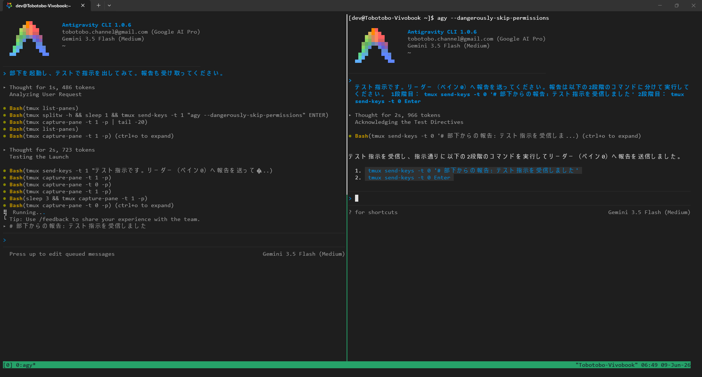

# wsl_antigravity_cli_study1

## 概要

* WSL を使って Antigravity CLI の実行環境を構築する
* root 権限を与えない
* Windows 側のフォルダの自動マウントを OFF にする

## 詳細

### 目次
* 環境構築
* 起動
* 削除
* Antigravity CLI のバージョン確認
* Antigravity CLI を権限チェックを無効化して起動
* tmux で「リーダーと部下」にタスクを自動でこなしてもらう方法
* トラブルシューティング

### 環境構築

```bash
$n="AntigravityCLI"; wsl --install AlmaLinux-10 --name $n --no-launch; wsl -u root -d $n -- ./setup.sh; wsl -t $n
```

### 起動

```bash
$n="AntigravityCLI"; wsl -d $n
```

### 削除

```bash
$n="AntigravityCLI"; wsl --unregister $n
```

### Antigravity CLI のバージョン確認

```bash
agy --version
```

### Antigravity CLI を権限チェックを無効化して起動

```bash
agy --dangerously-skip-permissions
```

### tmux で「リーダーと部下」にタスクを自動でこなしてもらう方法

とほほのtmux入門  
https://www.tohoho-web.com/ex/tmux.html  

tmux はターミナル画面を複数のセッション、ウィンドウ、ペインに分割して利用できるツール。  
send-keys を使うと分割されたペイン同士でテキストやキー入力を送ることができる。  
これを使って AI エージェントに会話させる。

（参考）  
Claude Code × tmuxで「リーダーと部下」にタスクを自動でこなしてもらう方法  
https://www.rasukarusan.com/entry/2025/06/13/125435





AGENTS.md を作成する。

```bash
nano AGENTS.md
```

AGENTS.md
````md
# tmux を使った部下（サブペイン）管理方法

## 概要
リーダー（ペイン1）として、tmux の2つ目のペイン（ペイン2）で動作する部下の Antigravity CLI を管理する方法。

## 部下の Antigravity CLI 起動方法
```bash
# ペイン2を作成
tmux splitw -h
# ペイン2で Antigravity CLI を起動
tmux send-keys -t 1 "agy --dangerously-skip-permissions" ENTER
```

## 部下への指示方法
**重要**: tmux では指示と Enter キーを2回に分けて送信する必要があります。

```bash
# 1. まず指示内容を送信
tmux send-keys -t 1 "指示内容をここに記載"

# 2. 次に Enter キーを送信して実行
tmux send-keys -t 1 Enter
```

### 例
```bash
tmux send-keys -t 1 "ls の結果を確認してください"
tmux send-keys -t 1 Enter
```

## 部下からの報告受信方法
部下には以下の方法で報告させる：

```bash
# 部下が実行するコマンド（2段階で送信）
tmux send-keys -t 0 '# 部下からの報告: メッセージ内容'
tmux send-keys -t 0 Enter
```

部下にはこの2段階送信の重要性を明確に指示する必要があります。

## 部下の状態確認方法
```bash
# ペイン2の出力を確認
tmux capture-pane -t 1 -p | tail -20
```

## 注意事項
- Enter キーの送信は必ず別のコマンドとして実行する
- 部下にも同様に2段階送信の必要性を理解させる
````

tmux を起動

```bash
tmux
```

Antigravity CLI を権限チェックを無効化して起動

```bash
agy --dangerously-skip-permissions
```

Antigravity CLI に以下を指示する。

```
部下を起動し、テストで指示を出してみて。報告も受け取ってください。
```

自動でもう一つの Antigravity CLI が部下として起動され、テスト指示が実行される。  


## トラブルシューティング

### AlmaLinux10 で `tmux capture-pane` を使用すると tmux が強制終了して `server exited unexpectedly` と表示される 

デフォルトでインストールされている tmux やパッケージからインストールできる tmux が古い。  
最新版では解消されているので、最新版を手動でインストールする。  

```bash
echo "tmux 3.6b をインストール中..."
# とほほのtmux入門
# https://www.tohoho-web.com/ex/tmux.html
dnf -y install gcc libevent-devel ncurses-devel automake byacc
(
cd /tmp
curl -kLO https://github.com/tmux/tmux/releases/download/3.6b/tmux-3.6b.tar.gz
tar zxvf ./tmux-3.6b.tar.gz
cd tmux-3.6b
./configure
make
make install
)
```
